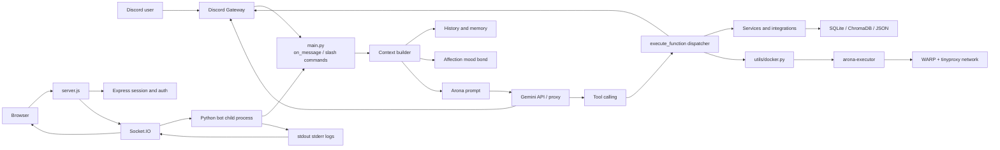
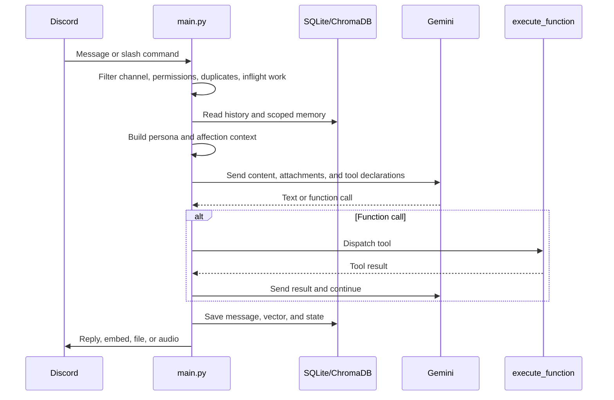
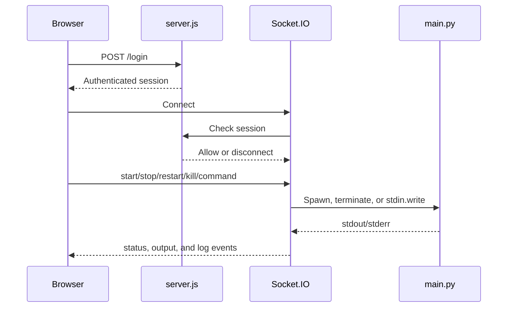
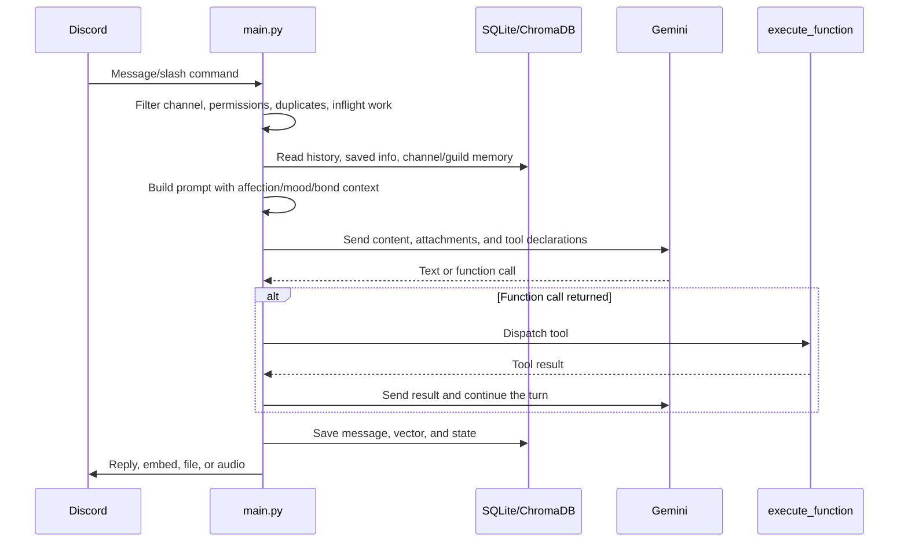
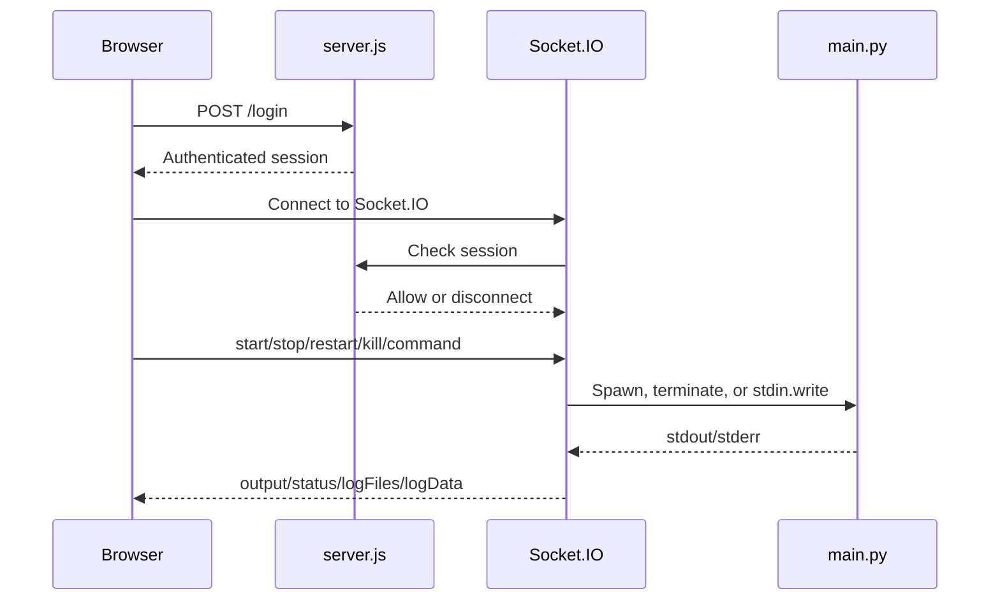

# Arona - Architecture and Operations Documentation

> Technical documentation for maintainers. This document is based on the source code and configuration currently present in the repository. Items that have not been verified in a live runtime are explicitly marked.

## 1. Overview

Arona is an AI Discord bot written primarily in Python. It provides an Arona character persona, text and voice interaction, long-term memory, an affection/mood/bond system, web integrations, and a Node.js control panel.

The project is experimental/development-stage software. The README states that parts of the codebase were generated automatically and may not be fully optimized. This document describes the current implementation, not a guarantee of production readiness.

### 1.1 Main components

| Component | Technology | Responsibility |
|---|---|---|
| Bot runtime | Python, `discord.py` | Receives Discord events and generates replies |
| AI orchestration | Gemini API over HTTP/WebSocket and function calling | Generates responses, selects tools, handles retries/fallbacks |
| Control panel | Node.js, Express, Socket.IO | Login, process control, logs, and commands |
| Frontend | HTML/CSS/JavaScript | Realtime terminal, controls, and log viewer |
| Launcher | Java `ServerUI.java`, `start.bat` | Windows launcher/controller |
| Persistent state | SQLite, ChromaDB, JSON | Memory, history, bond, tasks, and runtime state |
| Voice | Discord voice receive, HTTP TTS, RVC/Applio | Voice input, synthesis, conversion, and playback |
| Sandbox | Docker Compose, WARP, tinyproxy | Isolated execution of model-generated code |
| Game | `python-chess`, UCI engine | Chess gameplay inside Discord |

### 1.2 Main capabilities

- Discord text and voice interaction.
- User, channel, guild, and semantic context.
- Gemini function calling for web, GitHub, YouTube, media, scheduling, todo, chess, Blue Archive, files, and code execution.
- Text-to-speech and optional voice conversion.
- Mood, affection, and per-user bond tracking.
- Remote bot control through a web panel.
- Docker-based code and file analysis.

## 2. Overall architecture



### 2.1 Text conversation flow



### 2.2 Web control flow



Important boundaries:

- Python is the Discord runtime; the panel manages that process.
- Gemini tools consist of core tools and lazy-loaded groups.
- Message rows and vectors are one logical data update.
- Docker is the main isolation boundary for generated code.
- Voice depends on external services, not only Python packages.

## 3. Repository structure

```text
/
|-- main.py                         # Discord bot entry point
|-- config.py                       # Runtime constants and state paths
|-- server.js                       # Node control panel and process manager
|-- package.json                    # Node scripts and dependencies
|-- requirements.txt                # Python dependencies
|-- README.md                       # General project guide
|-- .env.example                    # Environment variable template
|-- generate_msg.py                 # Commit-message generator
|-- migrate_msgbank.py              # Message/vector migration
|-- start.bat                       # Java UI launcher
|-- sync.bat                        # Git add/commit/push helper
|-- ServerUI.java                   # Windows desktop controller
|-- cf_worker.js                    # Optional Cloudflare Worker proxy
|-- public/                         # Web panel frontend
|-- console/                        # Logger and runtime commands
|-- affection/                      # Mood, bond, and affection logic
|-- arona/                          # Persona, TTS, and voice stack
|-- utils/                          # Memory, tools, integrations, and utilities
|-- games/                          # Chess logic and assets
|-- database/                       # Runtime databases and skills
|-- docker/                         # Compose, image, and network scripts
|-- logs/                           # Runtime logs
|-- crashreports/                   # Crash dumps
|-- temp/, temp_audio/              # Temporary files
`-- fluidsynth/                     # Supporting audio files
```

### 3.1 Module groups

| Group | Representative modules | Responsibility |
|---|---|---|
| Runtime | `main.py`, `config.py` | Startup, event loop, Discord client, dispatcher |
| Persona | `arona/prompt.py` | System prompt and character rules |
| Memory | `utils/memory.py`, `msg_bank.py`, `vector_database.py` | Key-value memory, history, semantic retrieval |
| Scoped memory | `channel_memory.py`, `guild_memory.py`, `impression.py` | Channel/guild context and impressions |
| Relationship | `affection/manager.py`, `mood.py`, `bond.py` | Mood, affection, bond, prompt blocks |
| Tools | `tool_schemas.py`, `tool_groups.py` | Gemini declarations and TTL loading |
| Integrations | `github.py`, `youtube.py`, `schale_db.py`, `wiki.py` | External services |
| Media | `attachment.py`, `text_utils.py`, media modules | Attachments, audio, images, video |
| Operations | `console/`, `scheduler.py`, `raid_recovery.py` | Commands, tasks, recovery |
| Isolation | `utils/docker.py`, `docker/` | Untrusted code execution |
| Games | `games/chess.py` | Chess and UCI engine |

## 4. Discord bot lifecycle

### 4.1 Startup

`main.py` changes the working directory, installs a crash hook, configures logging, loads `.env` and `config.py`, initializes memory/scheduler/affection, registers Discord handlers, and starts supporting services after `on_ready()`.

Startup depends on local databases, API keys, ffmpeg, optional browser sessions, and optional voice services.

### 4.2 Message processing

Important symbols:

- `slash_arona()`: `/arona` slash-command entry point.
- `on_ready()`: Discord-ready lifecycle hook.
- `on_message()`: message, command, channel, and permission filtering.
- `handle_message()`: main conversation pipeline.
- `ask_gemini()`: Gemini request, retry/fallback, and tool-call handling.
- `execute_function()`: tool dispatcher.
- `run_code()`: Docker-backed Python/shell execution.
- `join_voice_channel()` and `leave_voice_channel()`: voice management.
- `save_active_channels()` and `save_ignored_channels()`: channel persistence.

Expected pipeline:

1. Receive a Discord message.
2. Check mentions, ignored channels, permissions, and inflight requests.
3. Read attachments, text, history, and scoped context.
4. Build persona, memory, mood, bond, impression, and time context.
5. Build Gemini tools; groups use a TTL.
6. Call Gemini.
7. Dispatch function calls and send results back in later turns.
8. Send a reply, embed, file, or audio.
9. Save messages/state and update affection/bond.

### 4.3 Retry, models, and quotas

`config.py` defines default/fallback/rate-limit/lite/live models, retry and timeout limits, maximum function turns, free-tier limits, the 503 unstick mechanism, thought-signature handling, and optional Cloudflare Worker routing.

`GEMINI_API_KEY` may be a JSON list or a single string. `main.py` normalizes both forms for key rotation.

### 4.4 Voice

- Discord voice receive/live: `discord-ext-voice-recv`, `AudioProcessor`, `GeminiWebSocket`.
- Text-to-speech/conversion: `arona/tts/tts.py`, `VoiceChangerBridge`, RVC/Applio.
- TTS default: `127.0.0.1:9880`.
- Applio/RVC default: `127.0.0.1:6969`.
- Reference audio and model paths: `config.py`.
- MoviePy is configured to use `ffmpeg.exe`.

Voice is optional and may require model weights, separate services, a desktop session, and a GPU.

## 5. Gemini tools and features

### 5.1 Tool mechanism

`utils/tool_schemas.py` creates Gemini function declarations. `get_gemini_tools()` provides core web/memory/profile/weather/user/Blue Archive tools, group-loading meta-tools, voice-session tools, current chess declarations, and the default-model `escalate` tool.

Text-channel groups unload after five incoming messages; loading a group refreshes the TTL. Voice groups remain available because voice sessions have no message stream for TTL tracking.

### 5.2 Tool groups

| Group | Scope |
|---|---|
| `chess` | Board state, moves, promotion, reset, board images |
| `scheduler` | Messages, AI tasks, recurring loops, edits, deletes |
| `dev` | Skills, code execution, file staging/edit/send, workspace |
| `github` | Repository search, trees, files, strings, commits |
| `blue_archive` | Gacha, birthdays, Schale DB |
| `media` | Reverse image, YouTube, songs, channel summaries |
| `todo` | Per-channel task lists |
| `migration` | Discord account linking/unlinking |

### 5.3 Prompt and persona

`arona/prompt.py` builds the persona, conversation rules, anti-hallucination rules, and tool guidance. The prompt is not a security boundary; tools still validate permissions, input, and scope.

`affection/manager.py` adds mood, bond, and tag context. Channel/guild memory and user information are injected before Gemini.

## 6. Memory and persistent data

### 6.1 Memory layers

1. **User key-value memory**: name, preferences, timezone, and similar facts.
2. **Message history**: per-user history for recent context and semantic search.
3. **Semantic memory**: long-term facts and summaries in ChromaDB.
4. **Channel memory**: free-form channel-scoped memory.
5. **Guild memory**: free-form server-scoped memory.
6. **Impressions**: context about users.
7. **Affection state**: global mood and per-user bond.

### 6.2 Database and file state

| Path | Data/role |
|---|---|
| `database/saved_information.db` | Per-user saved information |
| `database/msg_bank.db` | Message history, about 600 messages/user |
| `database/vector_db/` | Persistent ChromaDB and `msg_bank` collection |
| `database/affection.db` | Global mood and user bond |
| `database/apikeys.db` | BYOK keys, quota, encryption metadata |
| `database/schedule.db` | One-shot/recurring tasks and retries |
| `database/channel_memory.db` | Channel memory |
| `database/guild_memory.db` | Guild memory |
| `database/migration_keys.db` | Account migration keys |
| `database/thought_sig.db` | Expiring Gemini thought signatures |
| `database/active_channel.json` | Active bot channels |
| `database/ignored_channel.json` | Ignored channels |
| `games/chess_games.json` | Chess state |
| `games/chess_engine_sessions.json` | UCI engine sessions |
| `database/files/persistent/` | Persistent staged files |
| `logs/`, `crashreports/` | Logs and crash dumps |
| `docker/workdir/`, `docker/output/` | Executor workspace/output |

Database paths are built from `_BASE` in `config.py`; some voice and log paths remain relative.

### 6.3 MessageBank

`utils/msg_bank.py` uses `aiosqlite` for rows and ChromaDB for vectors. Rows contain user, channel, guild, display name, content, bot flag, and timestamp. Older rows are removed after the per-user limit. New messages use the `BAAI/bge-m3` embedding model. `get_recent_messages()` returns oldest-first, `search_messages()` performs user-scoped semantic retrieval, and `merge_into()` supports account migration.

Changes to schema or merge logic must be tested against both SQLite and the vector collection.

### 6.4 Migration

`migrate_msgbank.py` migrates message/vector data. `utils/migration_keys.py` manages account linking and root-account resolution. Back up SQLite and vector directories before migration.

## 7. Affection, mood, and bond

| Module | Responsibility |
|---|---|
| `affection/manager.py` | Coordinates mood/bond and builds prompt context |
| `affection/mood.py` | Global mood, ticks, idle/sleep, CPU temperature |
| `affection/bond.py` | Per-user bond, ranks, RAM cache, SQLite flush |
| `affection/__init__.py` | Initializes the `affection` facade |

Important values include a ten-second tick, bond flush every six ticks, sleep after one hour idle, mood drift/decay, CPU-temperature deltas, and ranks from zero to Max.

Mood is global, bond is user-scoped, and memory has several scopes.

## 8. Web control panel

### 8.1 Backend

`server.js` uses Express, sessions, Socket.IO, bcrypt, and rate limiting. Important functions are `ensurePasswordHash()`, `requireAuth()`, `startBot()`, `restartBot()`, `killBot()`, `checkSocketRateLimit()`, and `appendLog()`.

| Type | Name | Responsibility |
|---|---|---|
| HTTP | `GET /login.html` | Login page |
| HTTP | `POST /login` | Username/password authentication |
| HTTP | `GET /logout` | Destroys the session |
| HTTP | `GET /api/auth/status` | Session and bot status |
| Static | `public/` | Frontend files |
| Socket | `start`, `stop`, `restart`, `kill` | Process control |
| Socket | `command` | Writes to bot stdin |
| Socket | `toggleAutorestart` | Automatic restart setting |
| Socket | `loadLogs`, `logFiles` | Read/list logs |
| Socket | `status`, `output` | Status and output stream |

### 8.2 Frontend and process model

`public/index.html` contains the terminal, process controls, sidebar settings, auto-scroll, auto-restart, and log selection. It uses Socket.IO. `public/login.html` is the login view. `public/script.js` contains another implementation that calls `/logs` HTTP routes; those routes were not confirmed in the inspected `server.js`, so it may be legacy code.

The panel spawns Python in unbuffered mode. Panel privileges are the privileges of the Node process user; `command` and process actions are privileged operations.

## 9. Docker sandbox and network

### 9.1 Compose services

`docker/docker-compose.yml` defines:

- `warp`: privileged Cloudflare WARP with `NET_ADMIN`/`NET_RAW` and a killswitch.
- `proxy`: tinyproxy on port 8888 sharing the WARP namespace.
- `arona-executor`: code worker sharing the namespace and mounting workdir/output.

The executor uses Python 3.12 slim Debian Bookworm, data/document libraries, Node.js/npm, compiler/debug tools, ffmpeg, a read-only root filesystem, `noexec,nosuid,nodev` tmpfs for `/tmp` and home, dropped capabilities except `CHOWN`/`SETGID`/`SETUID`, `no-new-privileges`, and Compose limits of 3 CPUs and 8 GB RAM.

### 9.2 `utils/docker.py`

`AronaDocker` checks the container, can wake Docker Desktop on Windows, creates channel/message workspaces, sanitizes names, applies rate limits, runs Python/shell, collects output, and separates `OUTPUT_DIR` from `VIEW_DIR`.

Docker isolation is mandatory when `run_code` is enabled. Never expose the Docker daemon socket to the executor.

### 9.3 Network

The executor uses the shared WARP proxy. Compose configures HTTP/HTTPS, npm, and `NO_PROXY` variables. The executor no longer has network-administration capabilities according to the Dockerfile comments.

## 10. Technology and dependencies

### 10.1 Python

`requirements.txt` covers `aiohttp`, `requests`, `websockets`, Discord packages, `aiosqlite`, `chromadb`, `sentence-transformers`, `torch`, `numpy`, BGE-M3, BeautifulSoup, readability-lxml, markdownify, ddgs, OpenCV, Pillow, MoviePy, pydub, Playwright, yt-dlp, YouTube transcripts, python-chess, pygame, mido, trimesh, and python-dotenv.

### 10.2 Node.js

`package.json` uses Express, body-parser, Socket.IO, express-session, express-socket.io-session, bcrypt, express-rate-limit, dotenv, ansi-to-html, and Playwright as a development dependency.

### 10.3 System runtime

The README requires Python 3.10+ (3.11 recommended), Node.js, Java Runtime/JDK, Docker for sandbox features, and ffmpeg. Stockfish/UCI engine, Applio, GPT-SoVITS, and RVC may be required for optional features. The dedicated Docker image uses Python 3.12 and many apt packages; the Windows host may not have those binaries.

## 11. Configuration and environment variables

### 11.1 `.env`

Real values must never be committed.

| Variable | Responsibility |
|---|---|
| `DISCORD_TOKEN` | Discord bot token |
| `GEMINI_API_KEY` | JSON list or single Gemini key |
| `APIKEY_ENCRYPT_SECRET` | Fernet key for BYOK user keys |
| `CF_WORKER_URL` | Optional Cloudflare Worker proxy |
| `SERP_API_KEY` | Reverse image/web service |
| `SAUCENAO_API_KEY` | Anime/art reverse image search |
| `GITHUB_TOKEN` | GitHub integration |
| `GITHUB_ISSUES_TOKEN` | Issue actions |
| `WEATHER_API_KEY` | Weather search |
| `KLIPY_API_KEY`, `GIPHY_API_KEY` | GIF/media integrations |

`main.py` calls `load_dotenv(dotenv_path='.env')` during import.

### 11.2 `config.py`

Configuration covers Discord admins/ignore lists, Gemini models/limits/safety settings, logging, caches, scheduler retries, chess engine/ELO, Docker Desktop path, affection timing and mood thresholds, database paths, and voice/TTS/RVC model paths.

Use `.env.example` as the template, keep secrets outside version control, check relative paths after process-launch changes, and evaluate vector compatibility when changing the embedding model.

## 12. Installation and running

### 12.1 Windows setup

```bat
python -m venv .venv
.venv\Scripts\activate
pip install -r requirements.txt
npm install
copy .env.example .env
```

Then configure `.env`, review `config.py`, install ffmpeg, and install optional voice services.

### 12.2 Run bot and panel

```bat
python main.py
node server.js
```

The README documents the panel at `http://localhost:3000`; `npm start` runs `node server.js`.

### 12.3 Launcher

```bat
start.bat
```

The README says this launches the Java UI with `javaw ServerUI.java`. Verify JDK compatibility on the target machine.

### 12.4 Docker

From the `docker/` directory:

```bat
docker compose up -d --build
```

Review mounts, WARP registration, proxy health checks, and Docker permissions first. This is not a complete production deployment without secret management, backups, monitoring, and additional network policy.

## 13. Operations and maintenance scripts

| Script | Responsibility |
|---|---|
| `generate_msg.py` | Reads `git diff`, asks Gemini for a commit message, writes `.commit_msg.txt` |
| `sync.bat` | Runs add, message generation, commit, and push |
| `migrate_msgbank.py` | Migrates message-bank SQLite/ChromaDB data |
| `start.bat` | Opens the Java server UI |
| `utils/test_session_reuse.py` | Direct session-reuse test |
| `bond_editor.py` | Bond editing |
| `clean_context.py` | Temporary context/data cleanup |
| `debug.py` | Debug helper |

```bat
python migrate_msgbank.py
python migrate_msgbank.py --db database/msg_bank.db --chroma ./database/vector_db
```

Review `sync.bat` before use because the observed script contains `git push --force`.

## 14. Testing and observability

The only directly confirmed test file is:

```bat
python utils/test_session_reuse.py
```

The inspected tree does not show formal pytest setup, Discord/Gemini integration tests, panel authentication tests, Docker-boundary tests, migration tests, or a CI workflow.

Smoke-test checklist:

1. Import `config.py` and verify `.env` values are not logged.
2. Start `python main.py` with a suitable token/test guild.
3. Test text, attachments, and a function call.
4. Test saved information, recent history, and RAG save/query.
5. Test scheduling and restart.
6. Test panel login, Socket.IO, and log streaming.
7. If `run_code` is enabled, test cleanup and container user.
8. If voice is enabled, test TTS 9880, RVC 6969, ffmpeg, and permissions.

Logs are written under `logs/`; crashes go to `crashreports/crash_YYYYMMDD-HHMMSS.log`; the panel keeps an in-memory log buffer and streams output through Socket.IO.

## 15. Security and threat model

This section records issues visible in the source. It is not a penetration-test report.

### 15.1 Control panel

- `server.js` logs the username, password, and stored hash during login. Remove this in production.
- The session secret is hardcoded as `remote-panel-secret`; move it to an environment secret.
- Production cookie settings such as `httpOnly`, `secure`, and `sameSite` are not clearly configured.
- CSRF protection was not observed for login/control actions.
- `loadLogs` joins a client-supplied filename to `logDir`; validate with a basename/allowlist.
- `command` writes to bot stdin and must be treated as privileged process control.
- The login username is hardcoded; use administrative configuration for multiple operators.
- Rate limiting does not replace TLS, a reverse proxy, or network access control.

### 15.2 AI and code execution

- `run_code` allows arbitrary model-generated Python/shell code. Docker isolation is mandatory.
- Never expose the Docker daemon socket to the worker.
- Verify mounts, ownership, timeouts, CPU/RAM limits, and network egress.
- Retest the WARP/proxy killswitch after network changes.
- File and GitHub tools must validate paths, URLs, scope, and data leakage.

### 15.3 Secrets and runtime policy

- `.env`, `pass.txt`, `pass.hash`, BYOK databases, and logs may contain secrets.
- If `APIKEY_ENCRYPT_SECRET` is missing, BYOK data may become undecryptable after restart. Make the secret mandatory.
- Never log tokens, hashes, or passwords.
- `generate_msg.py` was observed to use a hardcoded `C:\arona` path for `.env`; make it portable.
- Several Gemini safety thresholds are `BLOCK_NONE`; review this policy.
- Playwright may use `headless=False`; servers without a desktop session may fail or hang.
- User-supplied API keys and external URLs are untrusted input.
- `sync.bat` uses `git push --force`.

## 16. Items requiring verification

1. Exact lifecycle of `affection.initialize()`/`affection.start()` and tick-task behavior during restart.
2. Whether `public/script.js` is active or legacy; it calls `/logs` while the inline panel uses Socket.IO.
3. Whether HTTP log routes exist elsewhere.
4. Actual database schema after long-running operation and migration.
5. ChromaDB compatibility with the configured embedding model and package versions.
6. Whether TTS 9880, Applio/RVC 6969, and model weights run in the expected process set.
7. `wmi`/`psutil` imports used by mood code are not clearly listed in `requirements.txt`.
8. The crash handler references `time` before its import during very early startup failures.
9. Whether the Stockfish/UCI engine path and assets exist on the host.
10. Whether `ServerUI.java` runs with the command in `start.bat` on the selected JDK.
11. Production TLS, proxy, backups, monitoring, supervision, and secret storage.

## 17. Symbol and entry-point index

### Runtime

`main.on_ready`, `main.on_message`, `main.handle_message`, `main.ask_gemini`, `main.execute_function`, `main.run_code`, `main.join_voice_channel`, `main.leave_voice_channel`

### AI and tools

`arona.prompt.get_arona_prompt`, `arona.prompt.get_live_arona_prompt`, `utils.tool_schemas.get_gemini_tools`, `utils.tool_groups`, `utils.malformed_recovery`, `utils.tool_status.get_function_execution_message`

### Memory and data

`utils.msg_bank.MessageBank`, `utils.memory.SavedInformationManager`, `utils.vector_database.rag_engine`, `utils.channel_memory`, `utils.guild_memory`, `utils.impression`, `utils.migration_keys`

### Relationship

`affection.manager.AffectionManager`, `affection.mood`, `affection.bond`

### Operations and integrations

`utils.scheduler`, `utils.docker.AronaDocker`, `games.chess.chess_manager`, `utils.github.GithubRepo`, `utils.youtube`, `utils.schale_db`, `arona.tts.tts.text_to_speech`, `arona.voicechanger.VoiceChangerBridge`

## 18. Recommended change workflow

1. Identify the owning module and affected state/database.
2. Back up SQLite, ChromaDB, JSON state, and model configuration before migrations.
3. Update tool schemas and prompts together when changing the Gemini contract.
4. Run the smallest relevant smoke test before a full bot test.
5. Check logs for secret leakage.
6. Rebuild Docker and test resource/network policy after Docker changes.
7. Update this document when adding an entry point, tool group, database, environment variable, or service.

---

**Document status:** Compiled from the current repository implementation. Update the verification section after major runtime changes.
# Arona - Architecture and Operations Documentation

> Technical documentation for maintainers. This document is based on the source code and configuration currently present in the repository. Items that have not been verified in a live runtime are explicitly marked.

## 1. Overview

Arona is an AI Discord bot written primarily in Python. It provides an Arona character persona, text and voice interaction, long-term memory, an affection/mood/bond system, web integrations, and a Node.js control panel.

The project is still experimental/development-stage software. The README states that parts of the codebase were generated automatically and may not be fully optimized. This document describes the current implementation; it is not a guarantee of a production-ready architecture.

### 1.1 Main components

| Component | Technology | Responsibility |
|---|---|---|
| Bot runtime | Python, `discord.py` | Receives Discord events and generates replies |
| AI orchestration | Gemini API over HTTP/WebSocket and function calling | Generates responses, selects tools, handles retries/fallbacks |
| Control panel | Node.js, Express, Socket.IO | Login, bot process control, logs, commands |
| Panel frontend | HTML/CSS/JavaScript | Realtime terminal, controls, log viewer |
| Launcher | Java `ServerUI.java`, `start.bat` | Windows desktop launcher/controller |
| Persistent state | SQLite, ChromaDB, JSON | Memory, history, bond, tasks, runtime state |
| Voice | `discord-ext-voice-recv`, HTTP TTS, RVC/Applio | Voice input, synthesis, and playback |
| Sandbox | Docker Compose, WARP, tinyproxy | Runs model-generated code inside an isolated container |
| Game | `python-chess`, UCI engine | Chess gameplay inside Discord |

### 1.2 Functional goals

- Converse with users on Discord.
- Maintain user, channel, guild, and semantic context.
- Use tools for web search, GitHub, YouTube, media, scheduling, todo lists, chess, Blue Archive, files, and code execution.
- Generate speech and join voice channels when the required services are available.
- Track Arona's mood, affection, and bond state.
- Control the bot remotely through a web panel.
- Run code and inspect files inside a Docker executor.

## 2. Overall architecture


### 2.1 Text conversation flow



### 2.2 Web control flow



### 2.3 Important boundaries

- The Python bot is the Discord runtime; the control panel manages that process rather than replacing it.
- Gemini tools are divided into always-available core tools and lazy-loaded groups.
- Message data has both SQLite rows and ChromaDB vectors. These should be treated as one logical update.
- The Docker sandbox is the most important isolation boundary because the model can generate Python or shell commands.
- Voice features depend on services outside the Python process, not only on `pip install`.

## 3. Repository structure

```text
/
|-- main.py                         # Discord bot entry point
|-- config.py                       # Runtime constants and state paths
|-- server.js                       # Node control panel and process manager
|-- package.json                    # Node scripts and dependencies
|-- requirements.txt                # Python dependencies
|-- README.md                       # General project guide
|-- .env.example                    # Environment variable template
|-- generate_msg.py                 # Generates a commit message from git diff
|-- migrate_msgbank.py              # Message/vector migration utility
|-- start.bat                       # Starts the Java UI
|-- sync.bat                        # Adds, generates a message, commits, and pushes
|-- ServerUI.java                   # Windows desktop launcher/controller
|-- cf_worker.js                    # Optional Cloudflare Worker proxy
|-- attachment.py                   # Discord attachment preprocessing
|-- debug.py                        # Debug flag/helper
|-- bond_editor.py                  # Bond editing utility
|-- clean_context.py                # Context cleanup utility
|-- public/                         # Web control panel frontend
|   |-- index.html                  # Terminal and controls view
|   |-- login.html                  # Login view
|   |-- script.js                   # Socket.IO client and log fetch code
|   `-- style.css                   # Additional stylesheet if referenced
|-- console/                        # Logger and runtime commands
|   |-- console.py
|   `-- command.py
|-- affection/                      # Mood, bond, and affection prompt logic
|   |-- __init__.py
|   |-- bond.py
|   |-- manager.py
|   `-- mood.py
|-- arona/                          # Persona and voice stack
|   |-- prompt.py
|   |-- voicechanger.py
|   |-- tts/tts.py
|   |-- tts/ttsapi/
|   `-- voice_engine/
|       |-- ref/
|       `-- src/
|-- utils/                          # Utilities and service adapters
|   |-- apikeys.py
|   |-- memory.py
|   |-- msg_bank.py
|   |-- vector_database.py
|   |-- channel_memory.py
|   |-- guild_memory.py
|   |-- scheduler.py
|   |-- tool_schemas.py
|   |-- tool_groups.py
|   |-- docker.py
|   |-- github.py
|   |-- youtube.py
|   |-- schale_db.py
|   |-- discord_ui.py
|   |-- edit_text_file.py
|   |-- todo.py
|   `-- ...
|-- games/                          # Game logic and assets
|   |-- chess.py
|   |-- assets/engine/
|   `-- ...
|-- database/                       # Runtime databases and data
|   |-- skills/                     # SKILL.md documents for development tools
|   |-- vector_db/
|   `-- ...
|-- docker/                         # Compose, image, and network scripts
|   |-- docker-compose.yml
|   |-- Dockerfile
|   |-- executor-entrypoint.sh
|   |-- warp-killswitch.sh
|   |-- iptables-guard.sh
|   `-- resolv.conf
|-- logs/                           # Bot/panel runtime logs
|-- crashreports/                   # Crash dumps
|-- temp/, temp_audio/              # Temporary files
`-- fluidsynth/                     # Supporting audio headers/libraries
```

### 3.1 Python module groups

| Group | Representative modules | Responsibility |
|---|---|---|
| Runtime | `main.py`, `config.py` | Startup, event loop, Discord client, dispatcher |
| Persona | `arona/prompt.py` | System prompt, character rules, voice/live prompts |
| Memory | `utils/memory.py`, `msg_bank.py`, `vector_database.py` | Key-value memory, history, semantic retrieval |
| Scoped memory | `channel_memory.py`, `guild_memory.py`, `impression.py` | Channel/guild context and user impressions |
| Relationship | `affection/manager.py`, `mood.py`, `bond.py` | Emotional state, bond, prompt blocks |
| Tools | `tool_schemas.py`, `tool_groups.py` | Gemini function declarations and TTL loading |
| Integrations | `github.py`, `youtube.py`, `schale_db.py`, `wiki.py` | External service access |
| Media | `attachment.py`, `text_utils.py`, media modules | Attachments, audio, images, and video |
| Operations | `console/`, `scheduler.py`, `raid_recovery.py` | Runtime commands, tasks, recovery |
| Isolation | `utils/docker.py`, `docker/` | Untrusted code execution |
| Games | `games/chess.py` | Chess and UCI engine integration |

## 4. Discord bot lifecycle

### 4.1 Startup

`main.py` changes the working directory, installs a crash hook, configures logging, loads `.env` and `config.py`, initializes state/memory/scheduler/affection, registers Discord handlers, and starts supporting services after `on_ready()`.

Important startup dependencies are local databases, external API keys, ffmpeg, optional browser sessions, and optional voice services.

### 4.2 Message processing

Important symbols in `main.py`:

- `slash_arona()`: `/arona` slash-command entry point.
- `on_ready()`: lifecycle hook after the Discord client becomes ready.
- `on_message()`: filters and receives messages, commands, channels, and permissions.
- `handle_message()`: main conversation pipeline.
- `ask_gemini()`: sends requests, handles retry/fallback, and receives tool calls.
- `execute_function()`: tool dispatcher.
- `run_code()`: sends Python/shell execution to Docker.
- `join_voice_channel()` and `leave_voice_channel()`: voice connection management.
- `save_active_channels()` and `save_ignored_channels()`: persist channel lists.

Expected pipeline:

1. Receive a Discord message.
2. Check mentions, ignored channels, permissions, and in-flight requests.
3. Read attachments, text, history, and channel/guild context.
4. Build a prompt from persona, memory, mood, bond, impressions, and time.
5. Build Gemini tools: core tools are always available; groups use a TTL.
6. Call Gemini.
7. Dispatch returned function calls and send results back in later turns.
8. Send a reply, embed, file, or audio.
9. Save messages/state and update affection/bond.

### 4.3 Retry, models, and quotas

`config.py` defines default/fallback/rate-limit/lite/live models, retry and timeout limits, maximum function turns, free-tier limits, the 503 unstick mechanism, thought-signature handling, and optional Cloudflare Worker routing.

`GEMINI_API_KEY` may be a JSON list or a single string. `main.py` normalizes both forms into a list for key rotation.

### 4.4 Voice

- Discord voice receive/live: `discord-ext-voice-recv`, `AudioProcessor`, and `GeminiWebSocket`.
- Text-to-speech and conversion: `arona/tts/tts.py`, `VoiceChangerBridge`, and RVC/Applio.
- TTS default: `127.0.0.1:9880`.
- Applio/RVC default: `127.0.0.1:6969`.
- Reference audio and model paths are defined in `config.py`.
- MoviePy is configured to use `ffmpeg.exe`.

Voice is optional and may require model weights, separate services, a desktop session, and a GPU.

## 5. Gemini tools and features

### 5.1 Tool mechanism

`utils/tool_schemas.py` creates Gemini function declarations. `get_gemini_tools()` provides core web/memory/profile/weather/user/Blue Archive tools, meta-tools for loading groups, voice-session tools, current chess declarations, and the default-model `escalate` tool.

Text-channel groups are loaded per channel and automatically unloaded after five incoming messages; loading a group refreshes the TTL. Voice groups remain available because voice sessions have no message stream for TTL tracking.

### 5.2 Tool groups

| Group | Scope |
|---|---|
| `chess` | Read board, make moves, promote pawns, reset, send board images |
| `scheduler` | Scheduled messages, AI tasks, recurring loops, edit/delete actions |
| `dev` | Read skills, run code, stage/edit/send files, workspace actions |
| `github` | Search repositories, inspect trees/files, search strings, commits |
| `blue_archive` | Gacha tracking, student birthdays, Schale DB |
| `media` | Reverse image, YouTube, song recognition, channel summaries |
| `todo` | Per-channel task lists |
| `migration` | Link and unlink Discord accounts |

### 5.3 Prompt and persona

`arona/prompt.py` builds the persona, conversation rules, anti-hallucination rules, and tool-use guidance. The prompt is not a security boundary; tools must still validate permissions, input, and scope.

`affection/manager.py` adds mood, bond, and tag context. Channel/guild memory and user information are injected before the Gemini call.

## 6. Memory and persistent data

### 6.1 Memory layers

1. **User key-value memory**: structured facts such as name, preferences, and timezone.
2. **Message history**: per-user history for recent context and semantic search.
3. **Semantic memory**: long-term facts and summaries in ChromaDB.
4. **Channel memory**: free-form memory scoped to a Discord channel.
5. **Guild memory**: free-form memory scoped to a Discord server.
6. **Impressions**: context about users.
7. **Affection state**: global mood and per-user bond.

### 6.2 Database and file state

| Path | Data/role |
|---|---|
| `database/saved_information.db` | Per-user saved information |
| `database/msg_bank.db` | Message history; about 600 messages/user |
| `database/vector_db/` | Persistent ChromaDB and `msg_bank` collection |
| `database/affection.db` | Global mood and user bond |
| `database/apikeys.db` | BYOK keys, quota, encryption metadata |
| `database/schedule.db` | One-shot/recurring tasks and retries |
| `database/channel_memory.db` | Channel memory |
| `database/guild_memory.db` | Guild memory |
| `database/migration_keys.db` | Account migration keys |
| `database/thought_sig.db` | Expiring Gemini thought signatures |
| `database/active_channel.json` | Active bot channels |
| `database/ignored_channel.json` | Ignored channels |
| `games/chess_games.json` | Chess game state |
| `games/chess_engine_sessions.json` | UCI engine sessions |
| `database/files/persistent/` | Persistent staged files |
| `logs/`, `crashreports/` | Logs and crash dumps |
| `docker/workdir/`, `docker/output/` | Executor workspace and output |

Database paths are built from `_BASE` in `config.py`; some voice and log paths remain relative paths.

### 6.3 MessageBank

`utils/msg_bank.py` uses `aiosqlite` for message rows and ChromaDB for vectors. Rows contain user, channel, guild, display name, content, bot flag, and timestamp. Older rows are removed after the per-user limit. New messages are embedded with `BAAI/bge-m3` on the configured device. `get_recent_messages()` returns oldest-first, `search_messages()` performs user-scoped semantic retrieval, and `merge_into()` supports account migration.

Schema or merge changes must be tested against both SQLite and the vector collection to avoid orphaned vectors or lost context.

### 6.4 Migration

`migrate_msgbank.py` migrates message/vector data. `utils/migration_keys.py` manages account linking and root-account resolution. Back up SQLite and vector directories before migration.

## 7. Affection, mood, and bond

| Module | Responsibility |
|---|---|
| `affection/manager.py` | Coordinates mood/bond, parses mood tags, builds prompt context |
| `affection/mood.py` | Global mood, periodic ticks, idle/sleep, CPU temperature |
| `affection/bond.py` | Per-user bond, ranks, RAM cache, SQLite flush |
| `affection/__init__.py` | Initializes the `affection` facade |

Important configuration includes a ten-second tick, bond flush every six ticks, sleep after one hour of inactivity, mood drift/decay, CPU-temperature deltas, and ranks from zero to Max with decreasing experience multipliers.

Mood is global, bond is user-scoped, and memory has several scopes.

## 8. Web control panel

### 8.1 `server.js` backend

Important functions are `ensurePasswordHash()`, `requireAuth()`, `startBot()`, `restartBot()`, `killBot()`, `checkSocketRateLimit()`, and `appendLog()`.

| Type | Name | Responsibility |
|---|---|---|
| HTTP | `GET /login.html` | Login page |
| HTTP | `POST /login` | Username/password authentication |
| HTTP | `GET /logout` | Destroys the session |
| HTTP | `GET /api/auth/status` | Returns session and bot status |
| Static | `public/` | Serves frontend files |
| Socket | `start`, `stop`, `restart`, `kill` | Bot process control |
| Socket | `command` | Writes a command to bot stdin |
| Socket | `toggleAutorestart` | Enables/disables automatic restart |
| Socket | `loadLogs`, `logFiles` | Reads/list logs |
| Socket | `status`, `output` | Process status and output stream |

Rate limiters exist for login, API requests, Socket.IO connections, and general requests.

### 8.2 Frontend

`public/index.html` contains the terminal, process controls, sidebar settings, auto-scroll, auto-restart, and log selection. It uses the Socket.IO client at `/socket.io/socket.io.js`.

`public/login.html` is the login view. `public/style.css` is an additional stylesheet if referenced. `public/script.js` contains another client implementation that calls `fetch('/logs')` and `fetch('/logs/:file')`; matching HTTP routes were not confirmed in the inspected `server.js`. It may be legacy or unused because the inline script in `index.html` uses Socket.IO.

### 8.3 Process model

The panel spawns Python in unbuffered mode so output can be streamed. Autorestart may start the bot again after a crash. Panel privileges are the privileges of the Node process user; `command` and process actions must therefore be treated as privileged operations.

## 9. Docker sandbox and network

### 9.1 Compose services

`docker/docker-compose.yml` defines:

- `warp`: Cloudflare WARP, privileged, with `NET_ADMIN`/`NET_RAW` and the killswitch.
- `proxy`: tinyproxy on port 8888, sharing the WARP network namespace.
- `arona-executor`: code worker sharing the network namespace and mounting workdir/output.

The executor uses Python 3.12 slim Debian Bookworm; includes data/document libraries, Node.js/npm, compiler/debug/reverse-engineering tools, ffmpeg, and file utilities; uses a read-only root filesystem; mounts `/tmp` and home as `noexec,nosuid,nodev` tmpfs; drops all capabilities except `CHOWN`, `SETGID`, and `SETUID`; enables `no-new-privileges`; and has Compose limits of 3 CPUs and 8 GB RAM.

### 9.2 `utils/docker.py`

`AronaDocker` checks the container, can wake Docker Desktop on Windows, creates channel/message workspaces, sanitizes filenames/message IDs, applies rate limits, runs Python/shell, collects output, and separates `OUTPUT_DIR` from `VIEW_DIR`.

Docker isolation is mandatory whenever `run_code` is enabled. The Docker daemon socket must not be exposed to the executor.

### 9.3 Network

The executor uses the shared WARP proxy. Compose configures HTTP/HTTPS proxy variables, npm proxy variables, and `NO_PROXY`. The killswitch lives in the WARP container; the executor no longer has network-administration capabilities according to the Dockerfile comments.

## 10. Technology and dependencies

### 10.1 Python

`requirements.txt` covers async/web (`aiohttp`, `requests`, `websockets`), Discord, SQLite, ChromaDB, sentence-transformers, Torch, NumPy, BGE-M3 embeddings, web extraction, OpenCV/Pillow/MoviePy/pydub media, Playwright, yt-dlp, YouTube transcripts, python-chess, pygame, mido, trimesh, and python-dotenv.

### 10.2 Node.js

`package.json` uses Express, body-parser, Socket.IO, sessions, bcrypt, express-rate-limit, dotenv, ansi-to-html, and Playwright as a development dependency.

### 10.3 System runtime

The README requires Python 3.10+ (3.11 recommended), Node.js, Java Runtime/JDK, Docker for sandbox features, and ffmpeg on PATH. Stockfish/UCI engine, Applio, GPT-SoVITS, and RVC may be required for optional features.

The dedicated Docker image uses Python 3.12 and many apt packages; this does not mean the Windows host has those binaries installed.

## 11. Configuration and environment variables

### 11.1 `.env` variables

Real values from `.env` must never be committed.

| Variable | Responsibility |
|---|---|
| `DISCORD_TOKEN` | Discord bot token |
| `GEMINI_API_KEY` | JSON list or single Gemini key |
| `APIKEY_ENCRYPT_SECRET` | Fernet key for BYOK user keys |
| `CF_WORKER_URL` | Optional Cloudflare Worker proxy |
| `SERP_API_KEY` | Reverse image/web service |
| `SAUCENAO_API_KEY` | Anime/art reverse image search |
| `GITHUB_TOKEN` | GitHub integration |
| `GITHUB_ISSUES_TOKEN` | Issue-related actions |
| `WEATHER_API_KEY` | Weather search |
| `KLIPY_API_KEY`, `GIPHY_API_KEY` | GIF/media integrations |

`main.py` calls `load_dotenv(dotenv_path='.env')` and reads these values during import.

### 11.2 Static configuration in `config.py`

Configuration covers Discord admins/ignore lists, Gemini models and limits, safety settings, logging, web/thought/GIF caches, scheduler retries, chess engine/ELO, Docker Desktop path, affection timing and mood thresholds, database paths, and voice/TTS/RVC model paths.

Use `.env.example` as the template, keep secrets outside version control, check relative paths after process-launch changes, and evaluate vector compatibility when changing the embedding model.

## 12. Installation and running

### 12.1 Basic Windows setup

```bat
python -m venv .venv
.venv\Scripts\activate
pip install -r requirements.txt
npm install
copy .env.example .env
```

Then configure `.env`, review `config.py`, install ffmpeg, and install optional voice services as needed.

### 12.2 Run the bot and panel

```bat
python main.py
node server.js
```

The README documents the panel at `http://localhost:3000`; `npm start` runs `node server.js`.

### 12.3 Launcher

```bat
start.bat
```

The README says that `start.bat` launches the Java UI with `javaw ServerUI.java`. Verify JDK compatibility on the target machine.

### 12.4 Docker

From the `docker/` directory:

```bat
docker compose up -d --build
```

Review mount paths, WARP registration, proxy health checks, and Docker permissions first. This Compose setup is not a complete production deployment without secret management, backups, monitoring, and additional network policy.

## 13. Operations and maintenance scripts

| Script | Responsibility |
|---|---|
| `generate_msg.py` | Reads `git diff`, asks Gemini for a commit message, writes `.commit_msg.txt` |
| `sync.bat` | Runs add, message generation, commit, and push |
| `migrate_msgbank.py` | Migrates message-bank SQLite/ChromaDB data |
| `start.bat` | Opens the Java server UI |
| `utils/test_session_reuse.py` | Direct session-reuse test/experiment |
| `bond_editor.py` | Bond editing utility |
| `clean_context.py` | Temporary context/data cleanup |
| `debug.py` | Debug helper |

Migration commands:

```bat
python migrate_msgbank.py
python migrate_msgbank.py --db database/msg_bank.db --chroma ./database/vector_db
```

Review `sync.bat` before use because the observed script contains `git push --force`.

## 14. Testing and observability

### 14.1 Current coverage

The only directly confirmed test file is:

```bat
python utils/test_session_reuse.py
```

The inspected tree does not show formal pytest setup, Discord/Gemini integration tests, panel authentication tests, Docker-boundary tests, migration tests, or a CI workflow.

### 14.2 Smoke-test checklist

1. Import `config.py` and verify that `.env` values are not logged.
2. Start `python main.py` with a suitable token/test guild.
3. Test text, attachments, and a function call.
4. Test saved information, recent history, and RAG save/query.
5. Test scheduling and bot restart.
6. Test panel login, Socket.IO, and log streaming.
7. If `run_code` is enabled, test output/temp cleanup and container user.
8. If voice is enabled, test TTS 9880, RVC 6969, ffmpeg, and permissions.

### 14.3 Logs and crashes

- Bot logs are written under `logs/` according to configuration.
- The crash handler writes `crashreports/crash_YYYYMMDD-HHMMSS.log`.
- The panel keeps an in-memory log buffer and reads log files through Socket.IO.
- Distinguish child-process stdout/stderr from persistent log files during debugging.

## 15. Security and threat model

This section records issues visible in the current source. It is not a penetration-test report.

### 15.1 Control panel

- `server.js` currently logs the username, password, and stored hash during login. Remove this in production.
- The session secret is hardcoded as `remote-panel-secret`; move it to an environment secret.
- Production cookie settings such as `httpOnly`, `secure`, and `sameSite` are not clearly configured.
- CSRF protection was not observed for login/control actions.
- `loadLogs` joins a client-supplied filename to `logDir`; validate with a basename/allowlist to prevent path traversal.
- `command` writes to bot stdin and must be treated as privileged process control.
- The login username is hardcoded; use administrative configuration for multiple operators.
- Rate limiting does not replace TLS, a reverse proxy, or network access control.

### 15.2 AI and code execution

- `run_code` allows the model to generate arbitrary Python/shell code. Docker isolation is mandatory.
- Do not expose the Docker daemon socket to the worker.
- Verify mounts, ownership, timeouts, CPU/RAM limits, and network egress.
- Treat the WARP/proxy killswitch as part of the security design and retest it after network changes.
- File and GitHub tools must validate paths, URLs, scope, and data leakage.

### 15.3 Secrets and encryption

- `.env`, `pass.txt`, `pass.hash`, BYOK databases, and logs may contain secrets and require suitable ignore/permission policies.
- If `APIKEY_ENCRYPT_SECRET` is missing, BYOK code may generate a runtime key; existing data may become undecryptable after restart. Make the secret mandatory and back it up securely.
- Never log tokens, hashes, or passwords.
- `generate_msg.py` was observed to use a hardcoded `C:\arona` path for `.env`; make it portable before using another machine.

### 15.4 Runtime policy

- `SAFETY_SETTINGS` sets several Gemini thresholds to `BLOCK_NONE`; review this policy for the deployment use case.
- Playwright may use `headless=False`; a server without a desktop session may fail or hang.
- User-supplied API keys and external URLs are untrusted input.
- `sync.bat` uses `git push --force`, which can overwrite remote history.

## 16. Items requiring verification

1. Exact lifecycle of `affection.initialize()`/`affection.start()` and whether tick tasks stop correctly during restart.
2. Whether `public/script.js` is active or legacy; it calls HTTP `/logs` while the inline panel script uses Socket.IO.
3. Whether HTTP log routes exist elsewhere.
4. Actual database schema after long-running operation and migration.
5. ChromaDB compatibility with the configured embedding model and package versions.
6. Whether TTS 9880, Applio/RVC 6969, and model weights run on the same machine/process set.
7. `wmi`/`psutil` imports used by mood code are not clearly listed in `requirements.txt`.
8. The crash handler references `time` before its import during very early startup failures.
9. Whether the Stockfish/UCI engine path and assets exist on the deployment host.
10. Whether `ServerUI.java` runs with the command in `start.bat` on the selected JDK.
11. Production deployment outside local Windows: TLS, reverse proxy, backups, monitoring, process supervision, and secret storage.

## 17. Symbol and entry-point index

### Runtime

- `main.on_ready`
- `main.on_message`
- `main.handle_message`
- `main.ask_gemini`
- `main.execute_function`
- `main.run_code`
- `main.join_voice_channel`
- `main.leave_voice_channel`

### AI and tools

- `arona.prompt.get_arona_prompt`
- `arona.prompt.get_live_arona_prompt`
- `utils.tool_schemas.get_gemini_tools`
- `utils.tool_groups`
- `utils.malformed_recovery`
- `utils.tool_status.get_function_execution_message`

### Memory and data

- `utils.msg_bank.MessageBank`
- `utils.memory.SavedInformationManager`
- `utils.vector_database.rag_engine`
- `utils.channel_memory`
- `utils.guild_memory`
- `utils.impression`
- `utils.migration_keys`

### Relationship

- `affection.manager.AffectionManager`
- `affection.mood`
- `affection.bond`

### Operations and integrations

- `utils.scheduler`
- `utils.docker.AronaDocker`
- `games.chess.chess_manager`
- `utils.github.GithubRepo`
- `utils.youtube`
- `utils.schale_db`
- `arona.tts.tts.text_to_speech`
- `arona.voicechanger.VoiceChangerBridge`

## 18. Recommended change workflow

1. Identify the owning module and affected state/database.
2. Back up SQLite, ChromaDB, JSON state, and model configuration before migration changes.
3. Update tool schemas and prompts together when changing the Gemini contract.
4. Run the smallest relevant smoke test before a full bot test.
5. Check logs for secret leakage.
6. When changing Docker, rebuild the image and test resource/network policy.
7. Update this document when adding an entry point, tool group, database, environment variable, or service.

---

**Document status:** Compiled from the current repository implementation. Update the verification section after major runtime changes.
