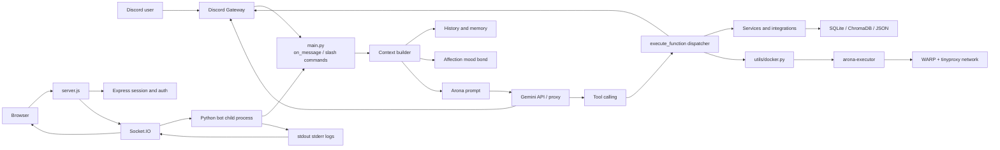
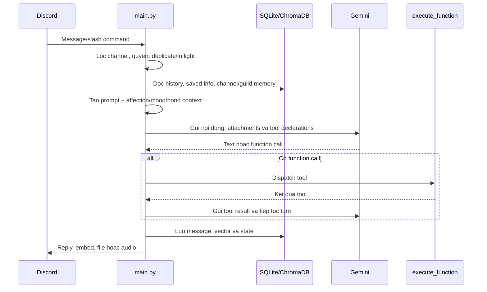
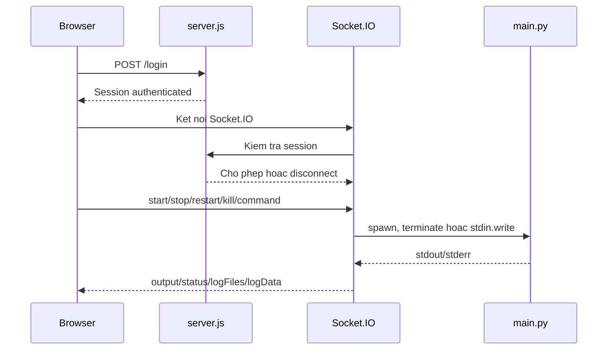

# Arona - Tai lieu kien truc va van hanh

> Tai lieu ky thuat danh cho maintainer. Noi dung duoc tong hop tu code va cau hinh hien co trong repository. Cac chi tiet chua duoc xac minh trong moi truong runtime duoc danh dau ro.

## 1. Tong quan

Arona la mot bot Discord AI viet chu yeu bang Python, co nhan vat hoi thoai Arona, ho tro van ban va voice, bo nho dai han, he thong affection/mood/bond, cac tich hop web va mot control panel chay bang Node.js.

Du an dang o trang thai experimental/development. README ghi ro mot phan code duoc tao tu dong va co the chua toi uu. Vi vay tai lieu nay uu tien mo ta hanh vi hien tai cua code, khong xem day la cam ket ve mot production architecture hoan chinh.

### 1.1 Thanh phan chinh

| Thanh phan | Cong nghe | Vai tro |
|---|---|---|
| Bot runtime | Python, `discord.py` | Nhan su kien Discord, tao hoi thoai va tra loi |
| AI orchestration | Gemini API qua HTTP/WebSocket va function calling | Sinh phan hoi, chon tool, xu ly retry/fallback |
| Control panel | Node.js, Express, Socket.IO | Dang nhap, start/stop/restart bot, xem log, gui lenh |
| Frontend panel | HTML/CSS/JavaScript | Terminal realtime, nut dieu khien, log viewer |
| Launcher | Java `ServerUI.java`, `start.bat` | Mo giao dien dieu khien tren Windows |
| Persistent state | SQLite, ChromaDB, JSON | Luu memory, message history, bond, task va trang thai |
| Voice | `discord-ext-voice-recv`, TTS HTTP, RVC/Applio | Nhan/gia lap voice va phat audio |
| Sandbox | Docker Compose, WARP, tinyproxy | Chay code do model sinh trong container cach ly |
| Game | `python-chess`, UCI engine | Choi co vua trong Discord |

### 1.2 Muc tieu chuc nang

- Hoi thoai voi nguoi dung tren Discord.
- Ho tro context ca nhan, channel, guild va semantic memory.
- Goi tool theo nhu cau: web, GitHub, YouTube, media, scheduler, todo, chess, Blue Archive, file va code sandbox.
- Tao giong noi va tham gia voice channel khi du runtime phu tro.
- Theo doi mood, affection va bond cua Arona.
- Dieu khien bot tu xa qua web panel.
- Chay code/phan tich file trong Docker executor.

## 2. Kien truc tong the



### 2.1 Luong hoi thoai van ban



### 2.2 Luong dieu khien qua web panel



### 2.3 Cac boundary can nho

- Python bot la process chinh; control panel khong phai la runtime Discord ma la process quan ly process.
- Gemini tools duoc chia thanh core tools va cac group lazy-loaded.
- Du lieu message co ca SQLite row va vector ChromaDB; hai lop nay phai duoc coi la mot cap nhat logic.
- Code sandbox la boundary an toan quan trong nhat khi model co the tao lenh Python/shell.
- Voice phu thuoc cac service ngoai process Python, khong chi phu thuoc `pip install`.

## 3. Cau truc repository

```text
/
|-- main.py                         # Entry point bot Discord
|-- config.py                       # Hang so runtime va duong dan state
|-- server.js                       # Node control panel + process manager
|-- package.json                    # Node scripts/dependencies
|-- requirements.txt                # Python dependencies
|-- README.md                       # Huong dan tong quan
|-- .env.example                    # Mau bien moi truong
|-- generate_msg.py                 # Sinh commit message tu git diff
|-- migrate_msgbank.py              # Migration message/vector data
|-- start.bat                       # Khoi dong Java UI
|-- sync.bat                        # Add, sinh message, commit va push
|-- ServerUI.java                   # Windows desktop launcher/controller
|-- cf_worker.js                    # Cloudflare Worker proxy tuy chon
|-- attachment.py                   # Tien xu ly attachment Discord
|-- debug.py                        # Debug flag/helper
|-- bond_editor.py                  # Cong cu chinh sua bond
|-- clean_context.py                # Cong cu don context
|-- comments_dump.txt               # Du lieu/ghi chu phu tro
|-- public/                         # Frontend control panel
|   |-- index.html                  # Giao dien terminal va controls
|   |-- login.html                  # Giao dien dang nhap
|   |-- script.js                   # Client Socket.IO va log fetch
|   `-- style.css                   # CSS (neu duoc dung boi view)
|-- console/                        # Logger va lenh runtime
|   |-- console.py
|   `-- command.py
|-- affection/                      # Mood, bond, affection prompt
|   |-- __init__.py
|   |-- bond.py
|   |-- manager.py
|   `-- mood.py
|-- arona/                          # Persona va voice stack
|   |-- prompt.py
|   |-- voicechanger.py
|   |-- tts/tts.py
|   |-- tts/ttsapi/
|   `-- voice_engine/
|       |-- ref/
|       `-- src/
|-- utils/                          # Tien ich va service adapters
|   |-- apikeys.py
|   |-- memory.py
|   |-- msg_bank.py
|   |-- vector_database.py
|   |-- channel_memory.py
|   |-- guild_memory.py
|   |-- scheduler.py
|   |-- tool_schemas.py
|   |-- tool_groups.py
|   |-- docker.py
|   |-- github.py
|   |-- youtube.py
|   |-- schale_db.py
|   |-- discord_ui.py
|   |-- edit_text_file.py
|   |-- todo.py
|   `-- ...
|-- games/                          # Game logic va asset
|   |-- chess.py
|   |-- assets/engine/
|   `-- ...
|-- database/                       # Runtime database/data
|   |-- skills/                     # SKILL.md cho tool dev
|   |-- vector_db/
|   `-- ...
|-- docker/                         # Compose, image va network scripts
|   |-- docker-compose.yml
|   |-- Dockerfile
|   |-- executor-entrypoint.sh
|   |-- warp-killswitch.sh
|   |-- iptables-guard.sh
|   `-- resolv.conf
|-- games/chess_games.json          # State co vua (runtime)
|-- logs/                           # Log bot/panel (runtime)
|-- crashreports/                   # Crash dump (runtime)
|-- temp/, temp_audio/              # File tam
`-- fluidsynth/                     # Header/lib phu tro cho audio
```

### 3.1 Nhom module Python

| Nhom | Module tieu bieu | Chuc nang |
|---|---|---|
| Runtime | `main.py`, `config.py` | Khoi dong, event loop, Discord client, dispatcher |
| Persona | `arona/prompt.py` | System prompt, quy tac nhan vat, prompt voice/live |
| Memory | `utils/memory.py`, `msg_bank.py`, `vector_database.py` | Key-value, lich su, semantic retrieval |
| Scope memory | `channel_memory.py`, `guild_memory.py`, `impression.py` | Context theo channel/guild va an tuong nguoi dung |
| Relationship | `affection/manager.py`, `mood.py`, `bond.py` | Tinh trang cam xuc, bond va prompt block |
| Tools | `tool_schemas.py`, `tool_groups.py` | Khai bao Gemini function va TTL lazy-loading |
| Integration | `github.py`, `youtube.py`, `schale_db.py`, `wiki.py` | Truy cap dich vu ngoai |
| Media | `attachment.py`, `text_utils.py`, movie/audio modules | Xu ly attachment, audio, anh, video |
| Operations | `console/`, `scheduler.py`, `raid_recovery.py` | Lenh runtime, task, recovery |
| Isolation | `utils/docker.py`, `docker/` | Chay code khong tin cay |
| Games | `games/chess.py` | Co vua va UCI engine |

## 4. Bot Discord va lifecycle

### 4.1 Khoi dong

`main.py` thuc hien cac buoc tong quat:

1. Doi current working directory ve thu muc chua `main.py`.
2. Cai `sys.excepthook` de ghi crash report.
3. Cau hinh logging va loc bot/voice log qua nhieu.
4. Nap `config.py`, `.env` va cac adapter.
5. Khoi tao cac state runtime, thought-signature SQLite, memory, scheduler, affection va Discord client.
6. Dang ky slash command/event handlers.
7. Khi Discord ready, sync command, mo cac service phu tro va bat console/scheduler theo code hien tai.

`on_ready()` la diem can kiem tra khi debug startup. Hanh vi chinh xac cua mot so service phu thuoc cac module duoc import va trang thai du lieu local.

### 4.2 Xu ly message

Cac symbol quan trong trong `main.py`:

- `slash_arona()`: entrypoint cho slash command `/arona`.
- `on_ready()`: lifecycle sau khi Discord client san sang.
- `on_message()`: loc va tiep nhan message, channel, command va quyen.
- `handle_message()`: pipeline hoi thoai chinh.
- `ask_gemini()`: gui request, retry, fallback model/key va tiep nhan tool call.
- `execute_function()`: dispatcher thuc thi tool.
- `run_code()`: dua Python/shell vao Docker sandbox.
- `join_voice_channel()`/`leave_voice_channel()`: quan ly voice connection.
- `save_active_channels()`/`save_ignored_channels()`: persist danh sach channel.

Pipeline mong doi:

1. Nhan message tu Discord.
2. Kiem tra bot mention, channel ignore, quyen va cac tin nhan dang xu ly.
3. Doc attachment, text, history va context channel/guild.
4. Tao prompt tu persona, memory, mood, bond, impression va thong tin thoi gian.
5. Lay danh sach Gemini tools: core luon co; group duoc nap theo TTL.
6. Goi Gemini.
7. Neu Gemini tra function call, dispatch tool va gui ket qua ve model trong cac turn tiep theo.
8. Gui phan hoi, embed, file hoac audio ve Discord.
9. Luu message/state va cap nhat affection/bond.

### 4.3 Retry, model va quota

`config.py` khai bao:

- Model mac dinh, fallback, model khi rate limit va lite/live model.
- `MAX_RETRIES`, `DEFAULT_TIMEOUT`, `MAX_FUNCTION_TURNS`.
- Free-tier daily limit theo user va soft limit toan cuc.
- Co che unstick request khi gap chuoi loi 503.
- `INCLUDE_THOUGHT` va thought signature expiry.
- Tuy chon Cloudflare Worker proxy qua `USE_CF_WORKER_PROXY`.

Gemini key trong `GEMINI_API_KEY` co the la JSON list hoac string don; `main.py` chuan hoa ca hai dang thanh list de rotate.

### 4.4 Voice

Voice co hai huong:

- Discord voice receive/live: `discord-ext-voice-recv`, `AudioProcessor`, `GeminiWebSocket`.
- Text-to-speech va voice changer: `arona/tts/tts.py`, `VoiceChangerBridge`, RVC/Applio.

Cau hinh dang chu y:

- TTS HTTP service mac dinh tai `127.0.0.1:9880`.
- Applio/RVC service mac dinh tai `127.0.0.1:6969`.
- Reference audio va model paths nam trong `config.py`.
- `ffmpeg.exe` duoc cau hinh cho MoviePy; system PATH van can du cac tool audio/video neu module khac goi truc tiep.

Day la nhom tinh nang tuy chon va co the can desktop session, model weights, service rieng va GPU.

## 5. Gemini tools va cac tinh nang

### 5.1 Co che tool

`utils/tool_schemas.py` tao declaration cho Gemini function calling. `get_gemini_tools()` phan biet:

- Core tools luon co: web, memory, profile, weather, user interaction, Blue Archive database.
- Meta tools `load_tools`/`unload_tools` cho text channel.
- Tool group duoc nap theo channel va tu dong het han sau 5 message; nap lai se refresh TTL.
- Voice session co mot so group luon bat vi khong co message stream de tick TTL.
- Chess declaration duoc tao lai de gan thong tin luot hien tai.
- Model mac dinh co them tool `escalate`.

### 5.2 Cac group

| Group | Pham vi |
|---|---|
| `chess` | Doc ban co, di chuyen, phong cap, reset, gui anh ban co |
| `scheduler` | Tin nhan hen gio, AI task, loop recurring, sua/xoa task |
| `dev` | Doc skill, chay code, file staging/edit/send, workspace |
| `github` | Tim repo, doc tree/file, tim chuoi, commit |
| `blue_archive` | Gacha tracker, sinh nhat hoc sinh, Schale DB |
| `media` | Reverse image, YouTube, nhan dien bai hat, tom tat channel |
| `todo` | Danh sach viec theo channel |
| `migration` | Tao key, lien ket/huy lien ket tai khoan Discord |

### 5.3 Prompt va persona

`arona/prompt.py` la noi dong goi nhan vat, quy tac hoi thoai, anti-hallucination va huong dan su dung tool. Prompt khong phai la security boundary; cac tool van phai tu kiem tra quyen, input va scope.

`affection/manager.py` tao block bo sung cho prompt tu mood/bond/tag. Memory channel/guild va user information cung duoc chen vao context truoc khi goi Gemini.

## 6. Memory va du lieu ben vung

### 6.1 Cac lop memory

1. **User key-value memory**: thong tin co cau truc nhu ten, so thich, timezone.
2. **Message history**: lich su hoi thoai theo user, dung cho recent context va semantic search.
3. **Semantic memory**: fact/tom tat dai han luu trong ChromaDB.
4. **Channel memory**: freeform memory theo Discord channel.
5. **Guild memory**: freeform memory theo Discord server.
6. **Impression**: an tuong/context ve nguoi dung.
7. **Affection state**: mood toan cuc va bond theo user.

### 6.2 Database va file state

| Path | Du lieu/role |
|---|---|
| `database/saved_information.db` | Saved information theo user |
| `database/msg_bank.db` | Message history; `MessageBank` gioi han khoang 600 message/user |
| `database/vector_db/` | Persistent ChromaDB, semantic memory va collection `msg_bank` |
| `database/affection.db` | Mood global va bond |
| `database/apikeys.db` | BYOK Gemini keys, quota, encryption metadata |
| `database/schedule.db` | One-shot/recurring task va retry |
| `database/channel_memory.db` | Memory theo channel |
| `database/guild_memory.db` | Memory theo guild |
| `database/migration_keys.db` | Key lien ket tai khoan |
| `database/thought_sig.db` | Gemini thought signatures co expiry |
| `database/active_channel.json` | Channel bot dang active |
| `database/ignored_channel.json` | Channel bi bo qua |
| `games/chess_games.json` | Trang thai game co vua |
| `games/chess_engine_sessions.json` | Session UCI engine |
| `database/files/persistent/` | File persist cho flow staging |
| `logs/`, `crashreports/` | Log va crash dump |
| `docker/workdir/`, `docker/output/` | Workspace va output cua executor |

Duong dan database chinh duoc tao tu `_BASE` trong `config.py`, vi vay runtime khong nen phu thuoc current working directory; tuy nhien mot so path voice/log trong code van la relative path.

### 6.3 MessageBank

`utils/msg_bank.py` dung `aiosqlite` cho row message va ChromaDB cho vector:

- Moi row co user, channel, guild, display name, content, bot flag va timestamp.
- Khi vuot gioi han, cac message cu hon bi xoa de giu toi da 600 row/user.
- Message moi duoc encode bang embedding model `BAAI/bge-m3` tren CPU theo config hien tai.
- `get_recent_messages()` tra oldest-first.
- `search_messages()` tim semantic toi da trong scope cua mot user, sau do doc lai row tu SQLite.
- `merge_into()` ho tro migration/merge data giua tai khoan.

Khi sua schema hoac logic merge, phai kiem tra ca SQLite va vector collection de tranh orphan vector hoac mat context.

### 6.4 Migration

`migrate_msgbank.py` danh cho migration message/vector tu DB cu sang layout hien tai. `utils/migration_keys.py` quan ly viec link tai khoan, trong do account moi co the dung data cua root account. Day la thao tac co tac dong du lieu lon, nen backup database va vector directory truoc khi chay.

## 7. Affection, mood va bond

| Module | Trach nhiem |
|---|---|
| `affection/manager.py` | Dieu phoi mood/bond, parse mood tag, tao context prompt |
| `affection/mood.py` | Mood global, tick dinh ky, idle/sleep, CPU temperature |
| `affection/bond.py` | Bond theo user, rank, cache RAM va flush SQLite |
| `affection/__init__.py` | Khoi tao facade `affection` |

Cac tham so dang chu y trong `config.py`:

- Tick moi 10 giay.
- Flush bond moi 6 tick, xap xi 60 giay.
- Sleep sau 1 gio idle.
- Mood drift/decay va delta theo nhiet do CPU.
- Rank bond tu 0 den Max, voi multiplier exp giam dan khi bond tang.

Can xem day la domain state doc lap voi chat history: mood co tinh global, bond co scope user, con memory co nhieu scope.

## 8. Web control panel

### 8.1 Backend `server.js`

Backend dung Express + session + Socket.IO. Cac thanh phan chinh:

- `ensurePasswordHash()`: doc `pass.txt`, tao/doi `pass.hash` bang bcrypt.
- `requireAuth()`: chan route protected khi chua authenticated.
- `startBot()`, `restartBot()`, `killBot()`: quan ly child process Python.
- `checkSocketRateLimit()`: gioi han event theo IP va loai event.
- `appendLog()`: giu buffer toi da 100 dong cho client moi ket noi.

Route va su kien quan sat duoc:

| Loai | Ten | Chuc nang |
|---|---|---|
| HTTP | `GET /login.html` | Trang dang nhap |
| HTTP | `POST /login` | Xac thuc username/password |
| HTTP | `GET /logout` | Huy session |
| HTTP | `GET /api/auth/status` | Kiem tra session va bot status |
| Static | `public/` | Tai frontend |
| Socket | `start` | Khoi dong bot |
| Socket | `stop` | Dung bot gracefully |
| Socket | `restart` | Khoi dong lai |
| Socket | `kill` | Ket thuc process |
| Socket | `command` | Gui lenh vao stdin bot |
| Socket | `toggleAutorestart` | Bat/tat tu khoi dong lai |
| Socket | `loadLogs` | Doc log theo ten file |
| Socket | `logFiles` | Danh sach log |
| Socket | `status` | Trang thai process |
| Socket | `output` | stdout/stderr realtime |

Server co cac rate limiter cho login, API, Socket.IO connection va request chung.

### 8.2 Frontend

`public/index.html` chua giao dien terminal, nut start/restart/kill, sidebar setting, auto-scroll, auto-restart va log dropdown. Giao dien su dung Socket.IO client duoc serve tai `/socket.io/socket.io.js`.

`public/login.html` la login view. `public/style.css` la stylesheet bo sung neu view tham chieu den no. `public/script.js` chua mot client implementation khac, trong do goi `fetch('/logs')` va `fetch('/logs/:file')`; cac route HTTP tuong ung chua duoc xac nhan trong phan route da doc cua `server.js`. Co kha nang day la code cu hoac khong con duoc `index.html` dung.

### 8.3 Process model

Panel spawn Python voi mode unbuffered de lay output realtime. Khi bot crash, `autorestart` co the khoi dong lai. Quyen cua panel tuong duong quyen user dang chay Node, do do `command` va cac action process can duoc xem la privileged operations.

## 9. Docker sandbox va network

### 9.1 Compose services

`docker/docker-compose.yml` co ba service:

- `warp`: Cloudflare WARP, privileged, `NET_ADMIN`/`NET_RAW`, killswitch.
- `proxy`: tinyproxy port 8888, dung chung network namespace voi WARP.
- `arona-executor`: worker chay code, cung network namespace, mount workdir/output.

Executor:

- Image Python 3.12 slim Debian Bookworm.
- Co Python data/document libraries, Node.js/npm, compiler/debug/reverse-engineering tools, ffmpeg va file utilities.
- Chay voi `read_only: true`.
- `/tmp` va home la tmpfs voi `noexec,nosuid,nodev`.
- Drop toan bo capability, chi giu `CHOWN`, `SETGID`, `SETUID`.
- `no-new-privileges`.
- Gioi han CPU 3.0 va RAM 8 GB theo Compose deploy resource config.
- Mount `workdir`, `output`, entrypoint va DNS config.

### 9.2 `utils/docker.py`

`AronaDocker` la adapter tu Python sang Docker CLI:

- Tu kiem tra container va co the danh thuc Docker Desktop tren Windows.
- Tao workspace theo channel/message.
- Sanitize filename/message id.
- Gioi han tan suat code execution.
- Chay Python/shell trong container va thu output.
- Tach `OUTPUT_DIR` de gui file va `VIEW_DIR` de xem media noi bo.

Model co the sinh code tuy y, do do Docker isolation khong phai tinh nang tuy chon neu bat tool `run_code`. Khong nen chay bot voi Docker socket duoc expose vao executor.

### 9.3 Network

Executor di qua proxy chung voi WARP. Compose dat `HTTP_PROXY`, `HTTPS_PROXY`, npm proxy va `NO_PROXY`. Killswitch nam o WARP container; executor khong con capability network administration theo comment trong Dockerfile.

## 10. Cong nghe va phu thuoc

### 10.1 Python

`requirements.txt` pin hoac gioi han cac nhom sau:

- Async/web: `aiohttp`, `requests`, `websockets`.
- Discord: `discord.py` tu commit cu the va `discord-ext-voice-recv` tu Git commit.
- Storage/AI: `aiosqlite`, `chromadb`, `sentence-transformers`, `torch`, `numpy`.
- Embedding: `BAAI/bge-m3` duoc tai qua sentence-transformers khi runtime can.
- Web extraction: BeautifulSoup, readability-lxml, markdownify, ddgs.
- Media: OpenCV, Pillow, MoviePy, pydub, pyzbar, ShazamIO.
- Video/web: Playwright, yt-dlp, YouTube transcript API.
- Game/audio: python-chess, pygame, mido, trimesh.
- Config: python-dotenv.

### 10.2 Node.js

`package.json` dung:

- Express, body-parser.
- Socket.IO va client.
- express-session va express-socket.io-session.
- bcrypt.
- express-rate-limit.
- dotenv, ansi-to-html.
- Playwright trong devDependencies.

### 10.3 System runtime

README yeu cau:

- Python 3.10+, khuyen nghi 3.11.
- Node.js.
- Java Runtime/JDK cho `start.bat`.
- Docker neu dung sandbox.
- ffmpeg tren PATH.
- Co the can Stockfish/UCI engine, Applio, GPT-SoVITS/RVC tuy tinh nang.

Docker image rieng dung Python 3.12 va nhieu apt package; khong dong nghia host Windows da co du cac binary do.

## 11. Cau hinh va bien moi truong

### 11.1 Bien `.env`

Mau nam trong `.env.example`. Gia tri that khong duoc commit.

| Bien | Bat buoc/tuy chon | Vai tro |
|---|---|---|
| `DISCORD_TOKEN` | Bat buoc cho bot | Discord bot token |
| `GEMINI_API_KEY` | Bat buoc cho AI | JSON list hoac mot key |
| `APIKEY_ENCRYPT_SECRET` | Can cho BYOK | Fernet key ma hoa key nguoi dung |
| `CF_WORKER_URL` | Tuy chon | Proxy Gemini qua Cloudflare Worker |
| `SERP_API_KEY` | Tuy tinh nang | Reverse image/web service |
| `SAUCENAO_API_KEY` | Tuy tinh nang | Reverse image anime/art |
| `GITHUB_TOKEN` | Tuy tinh nang | GitHub integration |
| `GITHUB_ISSUES_TOKEN` | Tuy tinh nang | Issue-related actions |
| `WEATHER_API_KEY` | Tuy tinh nang | Weather search |
| `KLIPY_API_KEY` | Tuy tinh nang | GIF/media |
| `GIPHY_API_KEY` | Tuy tinh nang | GIF/media |

`main.py` goi `load_dotenv(dotenv_path='.env')` va doc cac bien nay luc import.

### 11.2 Cau hinh tinh trong `config.py`

- Discord: `ADMINS`, ignore list, inflight delay.
- Gemini: model, temperature, timeout, retry, quota, safety settings, function turns.
- Logging: log dir, file size/rotation count.
- Cache: web crawl, thought signature, GIF.
- Scheduler: so lan retry.
- Chess: engine path, ELO, move time.
- Docker: duong dan Docker Desktop tren Windows.
- Affection: tick, sleep, mood drift/decay, temperature thresholds, rank.
- Database: root path, SQLite path, ChromaDB path.
- Voice: RVC model/index, Applio host/port, TTS URL, model weights va reference audio.

### 11.3 Quy tac van hanh config

- Dung `.env.example` lam mau, thay placeholder truoc khi chay.
- Khong copy token, password, hash hoac Fernet key that vao repository.
- Kiem tra cac relative path sau khi doi current directory hoac chay tu control panel.
- Neu doi embedding model, phai danh gia kha nang tuong thich voi vector DB hien tai.

## 12. Cai dat va chay

### 12.1 Cai dat co ban tren Windows

```bat
python -m venv .venv
.venv\Scripts\activate
pip install -r requirements.txt
npm install
copy .env.example .env
```

Sau do dien `.env`, kiem tra `config.py`, cai ffmpeg va cac service voice tuy chon.

### 12.2 Chay bot va panel

```bat
python main.py
node server.js
```

Panel mac dinh duoc README mo ta tai `http://localhost:3000`. `npm start` tuong duong `node server.js`.

### 12.3 Launcher

```bat
start.bat
```

`start.bat` goi Java UI (`javaw ServerUI.java`) theo README. Can kiem tra JDK/runtime phu hop voi cach chay source Java tren may cu the.

### 12.4 Docker

Chay tu thu muc `docker/` theo layout Compose hien tai:

```bat
docker compose up -d --build
```

Truoc khi chay can xem lai mount path, WARP registration, proxy healthcheck va quyen Docker. Khong coi Docker Compose la deployment production neu chua co secret management, backup, monitoring va network policy bo sung.

## 13. Script van hanh va bao tri

| Script | Chuc nang |
|---|---|
| `generate_msg.py` | Doc `git diff`, goi Gemini tao commit message, ghi `.commit_msg.txt` |
| `sync.bat` | `git add`, chay generator, commit va push branch main |
| `migrate_msgbank.py` | Migration SQLite/ChromaDB cua message bank |
| `start.bat` | Mo Java server UI |
| `utils/test_session_reuse.py` | Test/thuc nghiem session reuse |
| `bond_editor.py` | Cong cu chinh sua bond |
| `clean_context.py` | Don context/data tam |
| `debug.py` | Bat/tat debug helper |

Lenh migration duoc README ghi:

```bat
python migrate_msgbank.py
python migrate_msgbank.py --db database/msg_bank.db --chroma ./database/vector_db
```

`sync.bat` can duoc xem lai truoc khi dung vi co thao tac `git push --force` theo code duoc quan sat. Khong nen chay tren branch co thay doi cua nguoi khac ma chua backup.

## 14. Kiem thu va quan sat

### 14.1 Hien trang coverage

Hien chi xac nhan duoc test truc tiep:

```bat
python utils/test_session_reuse.py
```

Chua thay trong tree da doc:

- Bo pytest/test runner chinh thuc.
- Test integration Discord/Gemini.
- Test auth, session va Socket.IO command.
- Test Docker sandbox boundary.
- Test migration SQLite/ChromaDB.
- CI workflow.

### 14.2 Checklist smoke test

1. Import `config.py` va kiem tra `.env` khong log secret.
2. Khoi dong `python main.py` voi token/test guild phu hop.
3. Gui message text don gian, attachment va function call.
4. Kiem tra saved info, recent history, RAG save/query.
5. Kiem tra scheduler va restart bot.
6. Kiem tra login panel, Socket.IO va log streaming.
7. Neu bat `run_code`, kiem tra output/temp cleanup va container user.
8. Neu bat voice, kiem tra TTS 9880, RVC 6969, ffmpeg va audio permissions.

### 14.3 Log va crash

- Bot log vao `logs/` theo cau hinh.
- Crash handler ghi `crashreports/crash_YYYYMMDD-HHMMSS.log`.
- Panel giu log buffer trong RAM va doc log file theo Socket.IO.
- Khi debug, can phan biet stdout/stderr cua child process voi log file persistence.

## 15. Bao mat va threat model

Phan nay ghi lai hien trang can chu y cho maintainer. Day khong phai ket qua pentest.

### 15.1 Control panel

- `server.js` dang co log username, password va stored hash trong login flow. Day la thong tin nhay cam, can xoa ngay trong production.
- Session secret dang hardcode trong source (`remote-panel-secret` trong code hien tai). Can dua vao environment secret.
- Chua thay cau hinh production ro rang cho `httpOnly`, `secure`, `sameSite` cua cookie.
- Chua thay CSRF protection cho login/control action.
- `loadLogs` nhan ten file tu Socket.IO va ghep voi `logDir`; can validate basename/allowlist de tranh path traversal.
- `command` cho phep gui lenh vao stdin cua bot; day la quyen dieu khien process, phai gioi han auth va audit.
- Username dang login duoc hardcode trong server. Can dua vao cau hinh quan tri neu co nhieu operator.
- Rate limit co ton tai nhung khong thay the cho reverse proxy, TLS va network access control.

### 15.2 AI va code execution

- `run_code` cho phep model tao Python/shell tuy y. Docker isolation la boundary bat buoc.
- Khong expose Docker daemon socket vao worker.
- Kiem tra mount `workdir/output`, file ownership, timeout, CPU/RAM va network egress.
- WARP/proxy killswitch phai duoc coi la mot phan cua security design, khong tu dong an toan neu container/network thay doi.
- Cac tool file va GitHub can validate path, URL, scope va data leakage.

### 15.3 Secret va encryption

- `.env`, `pass.txt`, `pass.hash`, database BYOK va log co the chua secret; phai nam trong ignore/permission policy phu hop.
- Neu thieu `APIKEY_ENCRYPT_SECRET`, code BYOK co the tu sinh key runtime; sau restart co nguy co khong giai ma duoc du lieu cu. Can quy dinh secret bat buoc va backup an toan.
- Khong ghi token, hash hay password vao log.
- `generate_msg.py` co duong dan `.env` cung duoc ghi nhan la hardcode `C:\arona` trong code; can lam portable truoc khi dung tren may khac.

### 15.4 Runtime policy

- `SAFETY_SETTINGS` trong `config.py` dang dat mot so threshold Gemini o `BLOCK_NONE`; day la lua chon policy co rui ro va can review theo use case.
- Playwright co the chay `headless=False`; tren server khong co desktop session se loi hoac treo.
- API key user-supplied va external URLs can duoc coi la untrusted input.
- `sync.bat` co `git push --force`, co the ghi de remote history.

## 16. Diem can xac minh

Cac muc duoi day khong nen xem la contract cho den khi maintainer test trong runtime:

1. Lifecycle chinh xac cua `affection.initialize()`/`affection.start()` va viec task tick dung khi restart.
2. `public/script.js` co duoc dung hay la ban cu; no goi HTTP `/logs` trong khi panel inline script dung Socket.IO.
3. Route log HTTP co ton tai trong phan code khac hay khong.
4. Schema database thuc te sau khi bot da chay lau va migration da chay.
5. Moi tuong thich cua `chromadb` voi embedding model va version trong requirements.
6. TTS service 9880, Applio/RVC 6969 va model weights co duoc deploy cung may/process hay khong.
7. `wmi`/`psutil` duoc import boi mood nhung khong thay ro trong requirements; can kiem tra dependency thuc te.
8. Crash handler dung `time` trong luc import rat som truoc import `time`; can test nhom loi startup som.
9. Stockfish/UCI engine path va asset co thuc su ton tai tren deployment host.
10. Java `ServerUI.java` co chay duoc bang command trong `start.bat` tren JDK hien tai.
11. Production deployment ngoai Windows local: TLS, reverse proxy, backup, monitoring, process supervisor va secret store chua duoc mo ta day du.

## 17. Phu luc: symbol va entrypoint index

### Runtime

- `main.on_ready`
- `main.on_message`
- `main.handle_message`
- `main.ask_gemini`
- `main.execute_function`
- `main.run_code`
- `main.join_voice_channel`
- `main.leave_voice_channel`

### AI/tool

- `arona.prompt.get_arona_prompt`
- `arona.prompt.get_live_arona_prompt`
- `utils.tool_schemas.get_gemini_tools`
- `utils.tool_groups`
- `utils.malformed_recovery`
- `utils.tool_status.get_function_execution_message`

### Memory/data

- `utils.msg_bank.MessageBank`
- `utils.memory.SavedInformationManager`
- `utils.vector_database.rag_engine`
- `utils.channel_memory`
- `utils.guild_memory`
- `utils.impression`
- `utils.migration_keys`

### Relationship

- `affection.manager.AffectionManager`
- `affection.mood`
- `affection.bond`

### Operations/integration

- `utils.scheduler`
- `utils.docker.AronaDocker`
- `games.chess.chess_manager`
- `utils.github.GithubRepo`
- `utils.youtube`
- `utils.schale_db`
- `arona.tts.tts.text_to_speech`
- `arona.voicechanger.VoiceChangerBridge`

## 18. Quy trinh thay doi de xuat

1. Xac dinh module owner va state/database bi anh huong.
2. Tao backup cho SQLite, ChromaDB, JSON state va model config neu thay doi migration.
3. Sua tool schema/prompt cung luc neu thay doi contract voi Gemini.
4. Chay smoke test nho nhat truoc khi test full bot.
5. Kiem tra log khong ro ri secret.
6. Neu thay doi Docker, rebuild image va test resource/network policy.
7. Cap nhat tai lieu nay khi them entrypoint, tool group, database, env var hoac service moi.

---

**Trang thai tai lieu:** Tong hop theo code hien co tai thoi diem tao tai lieu. Hay cap nhat phan "Diem can xac minh" sau moi lan thay doi runtime lon.
